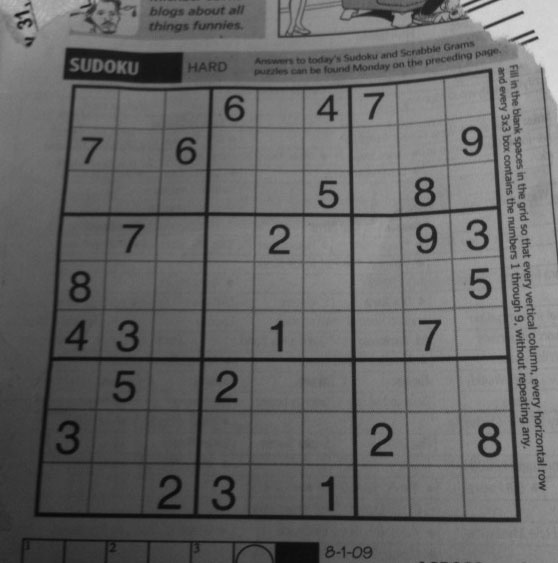
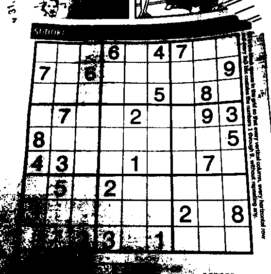
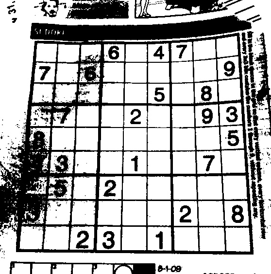
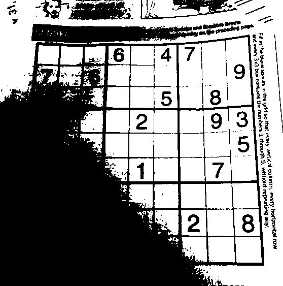
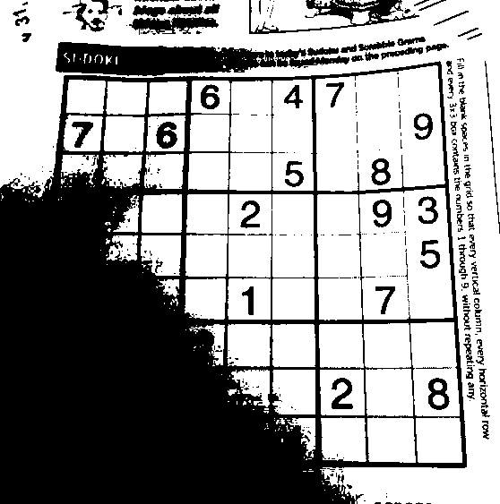
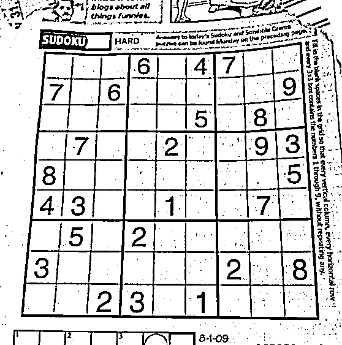
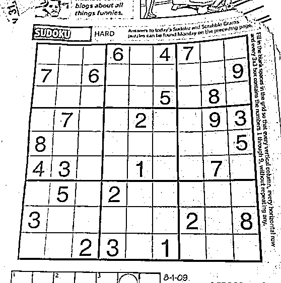

# Assignment for Chapter 4
## Thresholding

 이미지 내에서 특정 조건에 해당하는 영역을 추출하기 위해서는 여러가지 필터를 거쳐 얻게 된 이미지 또는 RGB/Gray 이미지로부터
 Thresholding 기법을 적용함으로써 이미지를 이진화 할 수 있다.

 Thresholding 기법은 단순 임계치를 비교하는 것으로부터,
적절한 임계치를 능동적으로 잘 선택하기 위한 Adaptive Thresholding 등의 방법들이 있다.

 본 과제에서는 아래 6가지 방법을 토대로 테스트를 진행하여 각 Thresholding 기법의 결과를 비교하였다.

* Source Image

### 1. 이미지에 대한 1차 평면 피팅을 통한 Thresholding

### 2. 이미지에 대한 2차 곡면 피팅을 통한 Thresholding

### 3. 이미지 전체 평균을 기준으로 Thresholding

### 4. Otsu 방법을 통한 Thresholding

### 5. Adaptive Mean Thresholidng

### 6. Adaptive Gaussian Thresholding

