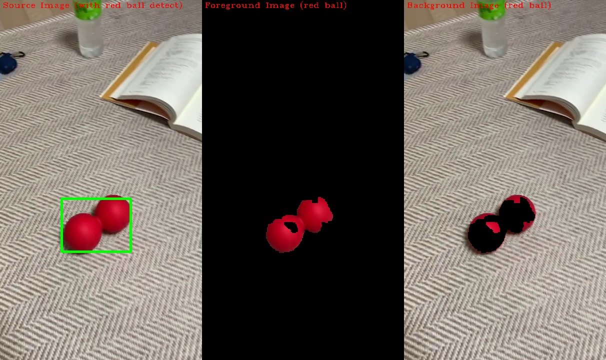

# Assignment for Chapter 4
## HSV

  일반적으로 이미지는 RGB (Red, Green, Blue)의 세가지 색으로 표현되어 있다. 세가지 색의 조합으로 다양한 색을 표현이 가능하다.
 하지만 RGB로 표현하기 어려운 부분이 있을 수 있다. 예를 들면 다음과 같은 상황이 있을 수 있다.

 <b>같은 물건이라도 주변의 조명이나 광원으로 인해 색이 달라보일 수 있다.</b>
   . 예를 들어 가정해보면, 동일한 하나의 사과가 햇빛에 있을 때와 실내 그늘에 있을 때의 밝기가 다를 수 있다. 

즉, 실제 색(Hue)는 같지만, 조명의 영향으로 인해 밝기(Value / Intensity)가 달라졌을 뿐이다. 이를 RGB를 통해 구분해내기는 어렵다. 이러한 것들을 해결하기 위해 색상 모델을 기존의 `RGB 모델`에서 `HSV 모델`로 변환하여 표현할 수 있다.

## Assignment
본 과제에서는 이러한 HSV 색상모델을 활용하여, 특정 물체를 추적(Tracking)하는 간단한 예제를 보인다.

구성은 다음과 같다.

1. 동영상을 VideoCapture를 통해 Load

2. Image를 HSV 색상모델로 변환후, 빨간색 range (hue의 범위 지정)를 설정하여 Thresholding 후 Mask 추출

3. 추출된 Mask를 토대로 Morphological Operation 수행

4. 필터링된 Mask 영역에 해당하는 좌표만으로, 무게중심과 분산을 계산하여 ROI를 결정한 후 시각화 한다.

## Result

