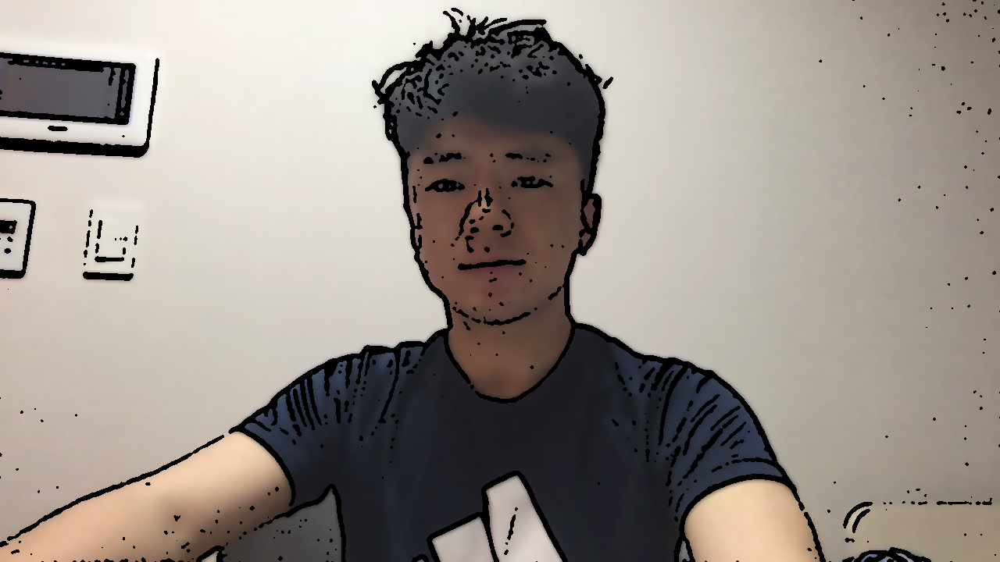

# Assignment for Chapter 6
## Edge Image
 이미지로부터 특정 오브젝트의 경계를 추출하고 싶을때 사용할 수 있는 다양한 연산 방법에 대해서 다룬다.
이는2차원 이미지에 2차원 kernel을 Convolution하여 변환된 이미지를 얻는 것으로 처리할 수 있다. 이때 영상처리에서 이미지의 경계는 색상 또는 밝기가 주변에 비해 변화가 크게 나타나는 영역을 나타낼 수 있을 것이다. 따라서 일반적으로 영상의 경계를 추출할 때에는 이미지를 미분하는 등의 방법을 통해 수행할 수 있다.

* Result
<b>Source Image</b>

<b>Comparation several edge operator</b>

## Scatch Effect
 책 6장에 나타난 Edge, Morphology, Blur 방법을 이용하면, 입력된 이미지를 그림과 같이 변환하는 효과를 간단하게 구현가능하다.
 먼저 그림의 스케치는 Edge를 추출함고 이에 Morphology 연산을 수행하여 생성가능하며, Blur 기법을 사용함으로써 채색 효과를 얻을 수 있다.

<b> Scatch Effect Result </b>

